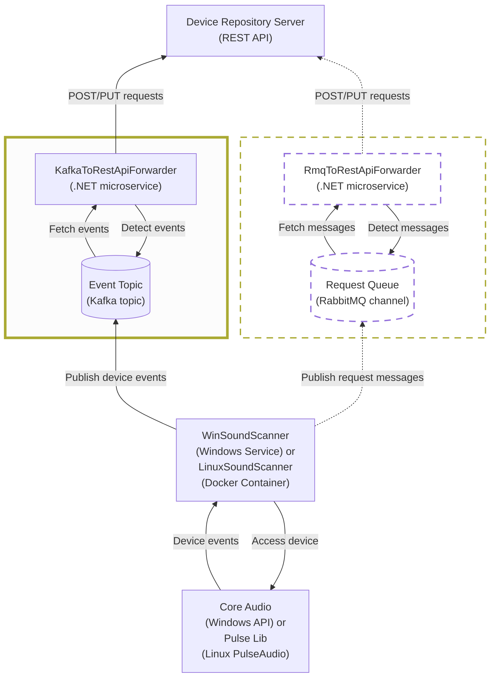

# kafka-to-rest-api-forwarder (KafkaToRestApiForwarder)

A forwarding microservice for sound messages in the Apache Kafka-based message workflow between scanners and a REST API.
KafkaToRestApiForwarder is similar to a RmqToRestApiForwarder microservice, leveraging the alternative RabbitMQ-based workflow.

## Motivation

KafkaToRestApiForwarder's purpose is to forward and deliver the Kafka events produced by Windows and Linux Sound Scanners (see [WinSoundScanner](https://github.com/collect-sound-devices/win-sound-scanner-go) and [LinuxSoundScanner](https://github.com/collect-sound-devices/linux-sound-scanner) )
to the audio device repository REST API, see [AudioDeviceRepoServer](https://github.com/collect-sound-devices/[DeviceRepositoryServer](https://github.com/collect-sound-devices/audio-device-repo-server))

## Place in *collect-sound-devices* Architecture

Apache Kafka is the request transport between the scanners and this forwarder.

<div style="zoom: 0.5;">


</div>


## Functions

- (Background) The Windows and Linux Sound Scanners transform the sound events into HTTP requests
 and publish them as events to a colocated Kafka topic.
- KafkaToRestApiForwarder runs in a Docker container on the same machine.
- It reads the events from a local Kafka topic and POSTs/PUTs to the configured API base URL.
- It applies debouncing of frequent volume-change PUT-requests.
  * The respective time window is configurable via `Kafka:Consumer:VolumeChangeEventDebouncingWindowInMilliseconds`.
- It guarantees reliable delivery with delayed retries
  * It retries failed API calls before committing the consumed Kafka offset.
  * It tries to awake the API if configured.  
  * A message is published to a dead-letter topic after the retry max is reached.
  * See settings: `Kafka:MessageDelivery:RetryDelayInSeconds`, `Kafka:MessageDelivery:MaxRetryAttempts`, `Kafka:Consumer:DeadLetterTopic`.


## Technologies Used

- KafkaToRestApiForwarder:
  - **.NET 10 Worker Service / Generic Host** builds the forwarding service.
  - **Confluent.Kafka** library for interacting with Kafka.
  - **NLog** logging library for .NET.
  - Distributed as a Docker container, see `docker-compose.yml`. The respective images are built via GitHub Actions CI/CD pipeline
    and regularly published to GitHub Container Registry.
- Kafka:
  - Distributed as a Docker container, see the official Apache Kafka Docker image and `docker-compose.yml`.

## Installation

1. Install Docker Desktop on the target machine
2. Download `docker-compose.yml` from the latest release assets [Release](https://github.com/collect-sound-devices/kafka-to-rest-api-forwarder/releases/latest) into a rollout folder.
3. Create a `logs` subfolder there.
4. Use `docker compose` to bring the Kafka and kafka-to-rest-api-forwarder containers up on the host machine:<br>
   Open a PowerShell prompt in the rollout folder and run:
     ```powershell
     docker compose up -d
     ```

## Developer Environment: How to Build and Run (Windows)

1. Install Visual Studio 2026 or the .NET 10 SDK
2. Restore packages and build the solution:

    ```powershell
    # Using dotnet CLI
    dotnet build KafkaToRestApiForwarder.sln -c Release
    ```

3. (Optional) Publish a self-contained single-file for Windows x64:

    ```powershell
    # Publish with the included publish profile
    dotnet publish "Projects/KafkaToRestApiForwarder/KafkaToRestApiForwarder.csproj" -c Release -p:PublishProfile=WinX64
    ```

## Changelog
- 2026-06-18: Logging runtime version, build information and operating system details at startup
- 2026-06-16: Debouncing of frequent volume-change PUT-requests 
- 2026-06-03: Extra API service is used to start an Audio Repository API Codespace 
- 2026-05-25: Initialized as alternative to RabbitMQ-to-REST-API-Farwarder

## License

This project is licensed under the terms of the [MIT License](LICENSE).

## Contact

Eduard Danziger

Email: [edanziger@gmx.de](mailto:edanziger@gmx.de)
